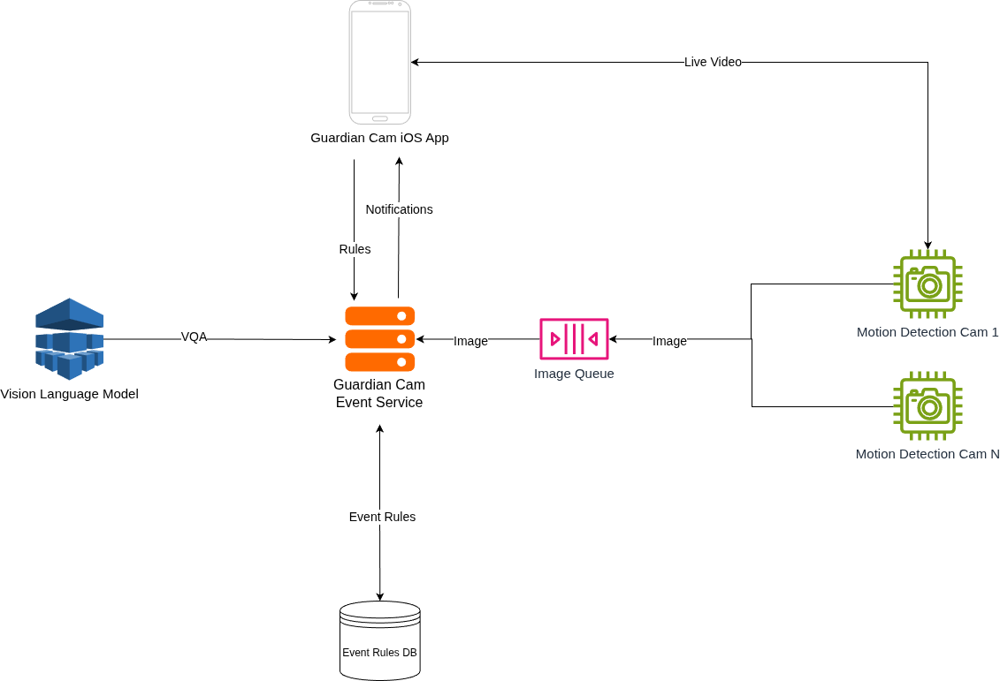

# GuardianCamEventService
The microservice hosting a REST API for the guardian cam system. Creates events based on images from received via the API.

## API
`POST /v1/events/predict/{user_id}`
* Takes an image as input and triggers an event based on the input image
and the configured event types for a user.

`POST /v1/events/rule/{user_id}`
* Defines a new rule for a user to decide if an event should be triggered.

### System Diagram

### Database Schema

#### Rules Table
| Column Name   | Data Type        |
|---------------|------------------|
| user_id       | UUID PRIMARY KEY |
| rule          | VARCHAR(140)     |
| camera_number | INT              |